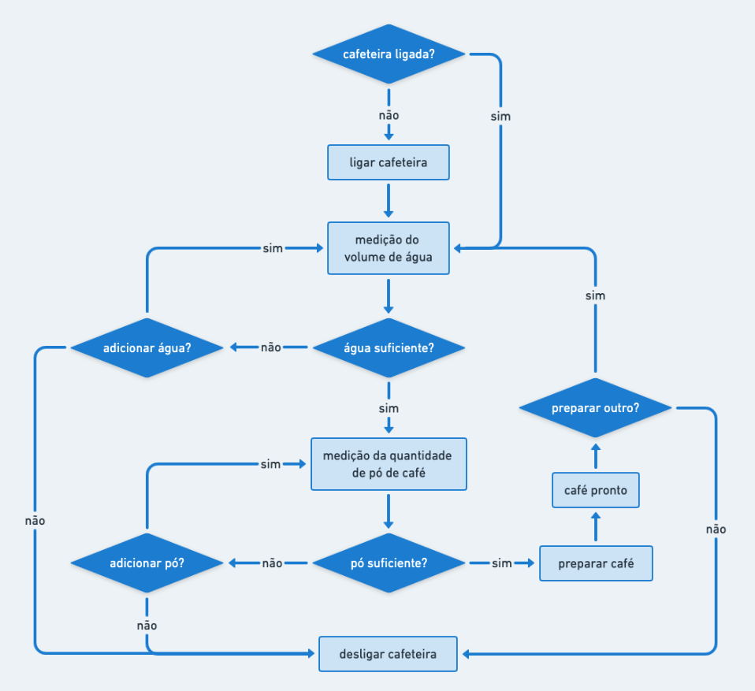
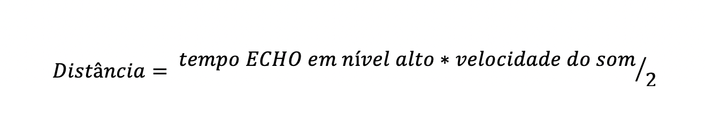
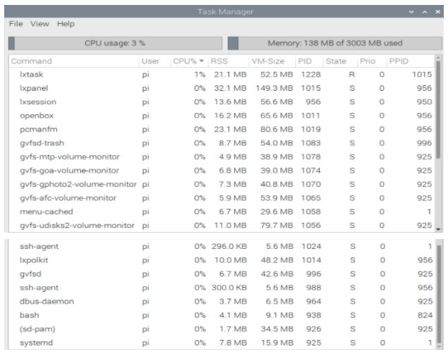
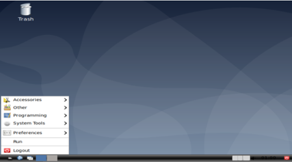
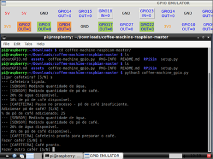

## :coffee: **[CES-33] Trilha**
> Alunos: Gabriel Crestani e Rafaella Bambokian - COMP21

**Proposta** - Simulação de controle de uma cafeteira em um sistema operacional Linux embarcado executado em máquina virtual.


### :one: Seção 1 - Objetivos do trabalho
A atividade proposta engloba o estudo e a aplicação de um sistema operacional Linux para o embarcado Raspberry Pi, de forma a configurar a versão escolhida para torná-la enxuta o suficiente a fim de não afetar o desempenho do programa proposto devido às restrições impostas pelo hardware dessa máquina.

A aplicação prática é definida pela simulação do controle de uma cafeteira a partir da interface do Raspberry Pi para intermediar ao programa o recebimento de dados e o envio de comandos.

No entanto, todo a execução foi virtualizada, ou seja, o sistema operacional escolhido foi instalado e executado em máquina virtual, os sensores para controle da cafeteira foram emulados a partir de uma biblioteca de simulação de portas programáveis de entrada e saída de um sistema embarcado e os dados que seriam estabelecidos por sensores ao analisar a cafeteira foram gerados coerentemente de acordo com a lógica implementada.

Dessa maneira, aprofundou-se o conceito de sistemas operacionais Linux configuráveis e de técnica de virtualização.


### :two: Seção 2 - Desenvolvimento do projeto
Diferenciar as características e escolher entre uma máquina virtual e um emulador foi o primeiro passo para o planejamento e desenvolvimento da proposta. Enquanto um emulador, através de uma camada de software, simula uma máquina de características distintas do computador sobre o qual ele opera, traduzindo todas as instruções para instruções do sistema hospedeiro, as máquinas virtuais, ao contrário do emulador, apesar de também se basearem em software, não abstraem todas as propriedades do hardware hospedeiro, uma vez que usufruem de componentes de hardware do computador real. Como o projeto em questão não preza prioritariamente pelo desempenho da aplicação e sim pelo estudo a fundo de um sistema operacional [Linux](https://pt.wikipedia.org/wiki/Linux), a simulação necessita apenas de uma prática coerente mais do que uma veracidade em relação ao hardware do sistema embarcado. Por isso, devido a já familiaridade com máquinas virtuais, optou-se pelo seu uso a partir do software de virtualização [VirtualBox](https://www.virtualbox.org/).

Foi realizado então um estudo para filtrar os sistemas operacionais embarcados baseados em Linux coerentes em relação à aplicabilidade da proposta. Para a escolha, uma vez que seria necessário alterar configurações de sistema para desativar pacotes inutilizados e garantir a correta funcionalidade do sistema operacional mesmo em execução em máquina virtual, tomou-se como base os seguintes requisitos:
- documentação abrangente
- robustez e leveza
- possibilidade de virtualização

_**Tabela 1.** Sistemas operacionais embarcados analisados para escolha e execução em máquina virtual._


Uma vez que tudo seria simulado, priorizou-se um sistema operacional em que informações sobre configurações e funcionalidades estivessem disponíveis amplamente para consulta, mais do que escolher por uma instalação de uma imagem já mínima, deixando a máquina com os pacotes de fato essenciais. Assim, a estratégia seguida foi testar a aplicação desenvolvida em um sistema operacional robusto e depois torná-lo enxuto, eliminando os pacotes desnecessários para a execução do programa.

Realizando um teste inicial com a virtualização do Raspbian, verificou-se o bom desempenho do sistema operacional em execução em uma máquina virtual configurada no software VirtualBox. Portanto, esse foi então definido como o sistema operacional Linux para o desenvolvimento do projeto.

A escolha da linguagem para implementação do código se deu com base na necessidade de emular os sinais dos pinos dos sensores para captar dados da cafeteira em portas de entrada e saída de um possível Raspberry Pi. Uma experimentação foi executada com a biblioteca [GPIO Simulator](https://pypi.org/project/GPIOSimulator/).

Após garantir um ambiente consistente para a aplicação, o fluxo de controle da cafeteira foi desenhado. Com base na lógica de passos descrita abaixo, os sensores foram escolhidos e o programa foi projetado. 


_**Figura 1.** Fluxo de controle da cafeteira simulada._

Para medir tanto o volume de água quanto a quantidade de pó de café disponíveis, foi definido o uso do sensor de distância ultrassônico - [HC-SR04](https://pypi.org/project/GPIOSimulator/). Idealmente, posicionando-o na abertura dos recipientes, esse é capaz de medir a distância até as superfícies a partir de ondas sonoras.


_**Figura 2.** O sensor de distância ultrassônico possui dois elementos principais - um transmissor e um receptor de som, posicionados lado a lado como mostrado na imagem. Para realizar uma medida, o transmissor é ativado e produz uma série de pulsos sonoros, que atingem o obstáculo em questão. Parte das ondas sofrem reflexão e são então captadas pelo receptor.  A diferença de tempo entre a transmissão dos pulsos sonoros e a captação pelo receptor é usada para calcular a distância até o objeto._

Na prática, para a medição é necessário alimentar o módulo e colocar o pino TRIGGER - referente ao sinal enviado - em nível alto por cerca de 10us. Assim, o sensor emite uma onda sonora que, ao encontrar um obstáculo, rebate de volta em direção ao módulo. Durante o tempo de emissão e recebimento do sinal, o pino ECHO - referente ao sinal de retorno - permanece em nível alto. Portanto, o cálculo da distância pode ser feito de acordo com o tempo em que o pino ECHO permaneceu em nível alto após o pino TRIGGER ter sido colocado em nível alto.



Na fórmula acima, a divisão por 2 deve-se ao fato de que a onda é enviada e rebatida, ou seja, ela percorre 2 vezes a distância procurada. A velocidade do som poder ser considerada idealmente igual a 340 m/s, logo o resultado é obtido em metros se o tempo for definido em segundos.

Para encenar o que foi descrito acima, propôs-se dois recipientes - um para água e um para pó de café - de mesma altura equivalente a 17cm. Com o sensor posicionado na abertura e considerando o reservatório vazio, o fundo se torna o obstáculo para o módulo e então, pela fórmula anteriormente mencionada, o tempo ECHO em nível alto é de 0.001s.

Além dos sensores, também foram definidas portas de saída para indicar se a cafeteira está ligada, se está apta para realizar o preparo do café e se o café está pronto.

Em relação ao código escrito em Python, a cafeteira foi implementada em forma de classe. Os atributos inicializados no momento da chamada do construtor definem as porcentagens de água e de pó de café disponíveis além do status da cafeteira - se ela está ligada e se está pronta para fazer um café, ou seja, se as quantidades medidas são suficientes. Também foram implementados métodos que permitem a interação com a máquina, como ligar e desligar, checar se está apta para fazer café, adicionar água ou pó de caf, comandar a elaboração do café e mais - aqueles que merecem destaque serão destrinchados a seguir.

```python
class Cafeteira:
 # pino 2 - out - cafeteira ligada?
 GPIO.setup(2, GPIO.OUT, initial = GPIO.LOW)
 # pino 3 - out - cafeteira apta?
 GPIO.setup(3, GPIO.OUT, initial = GPIO.LOW)
 # pino 4 - out - café pronto?
 GPIO.setup(4, GPIO.OUT, initial = GPIO.LOW)
 
 def __init__(self, porcentAgua, porcentCafe):
   # trecho de código omitido
   self.porcentAgua = porcentAgua
   self.porcentCafe = porcentCafe
 
 def TempoSensorAgua(self):
   return 0.001 * (100 - self.porcentAgua) / 100
 
 def TempoSensorCafe(self):
   return 0.001 * (100 - self.porcentCafe) / 100
```

No trecho mostrado acima, as variáveis `porcentAgua` e `porcentCafe` salvam as porcentagens de água e de pó de café disponíveis nos respectivos reservatórios. A partir daí, os métodos `TempoSensorAgua()` e `TempoSensorCafe()` retornam o tempo ECHO em nível alto em segundos que o sensor de distância ultrassônico mencionado anteriormente demoraria para medir uma determinada porcentagem de água ou café, considerando 0.001s para 0%.

Também nota-se a definição dos pinos de saída com o auxílio da biblioteca GPIO Simulator para representar um feedback visual de algumas variáveis que definem o estado da cafeteira.

```python
# Sobre a cafeteira, definiu-se:
# Recipiente cheio -> distância superfície sensor: 0m
# Recipiente vazio -> distância superfície sensor: 0.17m
 
# porcentagem de água necessária para preparo de 1 café -> 10% => equivale a distância superfície sensor = 0.153m
# porcentagem de pó necessário para preparo de 1 café -> 15% => equivale a distância superfície sensor = 0.1445m
 
class Cafeteira:
 # pino 2 - out - cafeteira ligada?
 GPIO.setup(2, GPIO.OUT, initial = GPIO.LOW)
 # pino 3 - out - cafeteira apta?
 GPIO.setup(3, GPIO.OUT, initial = GPIO.LOW)
 # pino 4 - out - café pronto?
 GPIO.setup(4, GPIO.OUT, initial = GPIO.LOW)
 
 # trechos de código omitidos
 
 def checarCafeteiraPronta(self):
   GPIO.output(4, GPIO.LOW)
   distSensorAgua = MedirAgua(self)
   distSensorCafe = MedirCafe(self)
   print('--- {}% de água disponível.'.format(self.porcentAgua))
   print('--- {}% de pó de café disponível.'.format(self.porcentCafe))
 
   if(distSensorAgua > 0.154 or distSensorCafe > 0.145):
     self.cafeteiraPronta = False
     GPIO.output(3, GPIO.LOW)
     if(distSensorAgua > 0.154):
       print('--- [CAFETEIRA] Pausa no processo - água insuficiente.')
     if(distSensorCafe > 0.145):
       print('--- [CAFETEIRA] Pausa no processo - pó de café insuficiente.')
   else:
     self.cafeteiraPronta = True
     GPIO.output(3, GPIO.HIGH)
     print('--- [CAFETEIRA] Cafeteira pronta para preparar o café.')
 
 # trechos de código omitidos
 
 def fazerCafe(self):
   if(self.cafeteiraPronta == True):
     self.porcentAgua -= 10
     self.porcentCafe -= 15
     time.sleep(3)
     print('--- [CAFETEIRA] Café pronto.')
     GPIO.output(4, GPIO.HIGH)
     self.cafeteiraPronta = False
     GPIO.output(3, GPIO.LOW)
 
def SensorAgua():
   # pinos 17 e 18 - sensor de distância - água
   GPIO.setup(17, GPIO.OUT, initial=GPIO.LOW) # TRIGGER
   GPIO.setup(18, GPIO.IN) # ECHO
 
def SensorCafe():
   # pinos 22 e 23 - sensor de distância - pó de café
   GPIO.setup(22, GPIO.OUT, initial=GPIO.LOW) # TRIGGER
   GPIO.setup(23, GPIO.IN) # ECHO
 
def MedirAgua(cafeteira):
 print('--- [SENSOR] Medindo quantidade de água.')
 GPIO.output(17, GPIO.HIGH)
 tempoTotal = cafeteira.TempoSensorAgua()
 time.sleep(tempoTotal)
 GPIO.output(17, GPIO.LOW)
 distancia = (tempoTotal * VEL_SOM) / 2
 return distancia
 
def MedirCafe(cafeteira):
 print('--- [SENSOR] Medindo quantidade de pó de café.')
 GPIO.output(22, GPIO.HIGH)
 tempoTotal = cafeteira.TempoSensorCafe()
 time.sleep(tempoTotal)
 GPIO.output(22, GPIO.LOW)
 distancia = (tempoTotal * VEL_SOM) / 2
 return distancia
```

O método `checarCafeteiraPronta()` presente na `classe Cafeteira` faz uso dos sensores simulados definidos pelas funções `SensorAgua()` e `SensorCafe()`, nas quais os pinos de entrada e saída ECHO e TRIGGER são inicializados também com o auxílio da biblioteca GPIO Simulator. Assim, as funções `MedirAgua()` e `MedirCafe()` garantem o funcionamento dos sensores 'artificiais' ao calcular a distância entre cada par módulo superfície a partir do tempo retornado por `cafeteira.TempoSensorAgua()` e `cafeteira.TempoSensorCafe()`. Com isso, `distSensorAgua > 0.154` e `distSensorCafe > 0.145`, garantem a quantidade mínima necessária para se fazer café - 10% de água e 15% de pó de café disponíveis, como se pode confirmar pelo método `FazerCafe()`.

Por fim, depois de garantir o correto funcionamento da aplicação descrita, analisou-se quais programas de software são imprescindíveis para permitir a execução do projeto. Com isso, foi possível eliminar os demais pacotes de forma a tornar o sistema operacional escolhido mais enxuto. A seguir, são descritas maneiras estudadas para a realização dessa etapa.

A instalação do Raspbian consistiu em baixar a sua imagem [.iso](https://www.raspberrypi.org/downloads/raspberry-pi-desktop/ ) e instalá-la com as configurações padrão no software [VirtualBox](https://www.virtualbox.org/), seguindo o seguinte [tutorial](https://roboticsbackend.com/install-raspbian-desktop-on-a-virtual-machine-virtualbox/ ).



_**Figura 3.** Interface do Raspbian assim que instalado._

O Raspbian apresenta um Task Manager de forma nativa, que pode ser usado para monitorar as tarefas que estão rodando no sistema operacional e a utilização de recursos por cada uma delas. Aqui, encontramos informações tais como:
- Command: nome da task;
- User: o proprietário do processo;
- CPU%: a porcentagem de utilização da CPU pelo processo;
- RSS (Resident Set Size): quantidade de memória ocupada pelo processo que está alocada em RAM;
- PID (Process ID): ID do processo;
- State: estado atual do processo;
- Prio (Priority): prioridade do processo;
- PPID (Parent Process ID): ID do pai do processo atual.


_**Figura 4.** Task Manager do Raspbian em execução logo após o boot do sistema operacional._

_Observação:_ o Raspbian em questão está sendo utilizado com o LXDE (Lightweight X11 Desktop Environment), que é um ambiente de desktop leve e rápido. Ele foi projetado para ser fácil de usar e elegante, mantendo baixo o uso de recursos. O LXDE usa menos RAM e menos CPU, sendo um ambiente de desktop rico em recursos.

Detalhando o propósito de cada [task](https://wiki.lxde.org/ ) e analisando sua real necessidade para o propósito deste projeto, tem-se:
- lxpanel: é o painel padrão do LXDE, pode ser usado para gerar um menu de aplicações instaladas automaticamente.
- lxtask: é o task manager padrão e monitor de sistema do LXDE.
- lxsession: gerenciador de sessões padrão do LXDE.
- openbox: cuida do gerenciamento de janelas, sendo o LXDE construido em torno dele.
- pcmanfm: é o gerenciador de arquivos padrão do LXDE.
- gvfsd-trash: gerencia a lixeira.
- gvfs-mtp-volume-monitor: suporte para MTP (Media Transfer Protocol).
- gvfs-goa-volume-monitor: suporte para GOA (GNOME Online Accounts)
- gvfs-gphoto2-volume-monitor: suporte para Picture Transfer Protocol.
- gvfs-afc-volume-monitor: suporte para AFC (Apple File Conduit).
- menu-cached: monitora mudanças nas aplicações e atualiza a cache do sistema.
- gvfs-udisks2-volume-monitor: responsável por disks, media, mounts e fstab.
- ssh-agent: programa que rastreia os identity keys e passphrases do usuário.
- lxpolkit: é usado para controlar privilégios em todo o sistema.
- gvfsd: daemon principal dos GVfs
- dbus-daemon: usa a biblioteca D-Bus (provê comunicação entre duas aplicações) para implementar um “message bus daemon”.
- bash: bash (:
- (sd-pam) e  systemd: processos essenciais do sistema.

Assim, observou-se que as task iniciadas com “lx”, que são relacionadas com o LXDE (ambiente de desktop) são as que mais estavam consumindo recursos do SO e serviram como foco inicial para a limpeza do sistema.

Após isso, utilizou-se outra aplicação nativa “Add/Remove Software” do Raspbian para analisar os pacotes instalados:


_**Figura 5.** “Add / Remove Software” usado para analisar os pacotes automaticamente instalados no Raspbian._

Após observar a quantidade imensa de pacotes instalados e não ser um trabalho factível analisar cada pacote e julgar sua real necessidade no nosso projeto, buscou-se alguma ferramenta pronta para realizar uma limpeza geral de pacotes no Raspbian. Assim, encontrou-se o projeto [Lean-pi](https://github.com/Ravbug/lean-pi), que serve justamente para remover diversos pacotes não essenciais e, inclusive, tornar a interface gráfica mais leve e enxuta.

Com isso, rodando o script do lean-pi no Raspbian, obteve-se o seguinte resultado:


_**Figura 6.** Interface do Raspbian após a utilização do lean-pi._

Assim, observa-se que foi realizada uma limpeza em diversos pacotes, como IDEs de diversas linguagens de programação, games, simuladores, etc. Além disso, a interface visual do ambiente desktop ficou mais limpa e enxuta, economizando recursos nesse sentido também.


### :three: Seção 3 - Validação do projeto 
A Figura 7 mostra a configuração de pinos utilizadas neste projeto, juntamente com o significado de cada um. Esta interface gráfica de pinos provém da biblioteca [GPIOSimulator](https://pypi.org/project/GPIOSimulator/) e cada pinos representado está associado a um pino real presente no hardware do Raspberry Pi.


_**Figura 7.** Pinos do simulador utilizados no projeto._

A seguir são feitos os testes para verificar o funcionamento da emulação dos pinos e da máquina de estados do programa da cafeteira. Na Figura 8, o programa acabara de ser iniciado e o pino GPIO2 indica que a cafeteira foi ligada com sucesso, porém o pino GPIO3 indica que falta algum recurso (água ou café) para fazer o café. Na Figura 9, ao adicionar uma quantidade suficiente de café, a cafeteira passa para o estado pronto, indicada pelo pino GPIO3, e aguarda o comando de fazer café. Na Figura 10, ao dar o comando de fazer café, o pino GPIO4 indica que o café está pronto e o pino GPIO3 recebe valor 0 para que possa ser realizada uma nova leitura dos valores de água e pó de café antes de fazer outro café.


_**Figura 8.** Estado em que se acabou de ligar a cafeteira._


_**Figura 9.** Estado em os sensores já analisaram os recipientes de água e café e conclui-se que a cafeteira está pronta para fazer café._


_**Figura 10.** Ao terminar de fazer o café, a cafeteira é passada para estado de não pronto para que possa ser realizada uma nova leitura dos níveis de água e café._

Após a verificação do correto funcionamento do programa e do simulador de pinos, analisou-se o consumo de recursos do sistema operacional. Comparando-se as Figuras 4 e 11, foram removidos processos não essenciais tais como: gvfsd-trash, gvfs-mtp-volume-monitor, gvfs-goa-volume-monitor, gvfs-gphoto2-volume-monitor, gvfs-afc-volume-monitor, gvfs-udisks2-volume-monitor, ssh-agent e gvfsd, que, no geral, são processos que adicionam suporte a ferramentas e acessórios que não são essenciais ao nosso projeto. Assim, foi possível economizar recursos da máquina, como memória, e deixá-los disponíveis para nossa aplicação alvo; além disso, remover processos não essenciais ou que não estão sendo utilizados trazem mais segurança ao sistema operacional, visto que desaloca e remove privilégios de processos inúteis para o propósito do nosso projeto.


_**Figura 10.** Ferramenta Task Manager após a remoção de processos não essenciais._

### :four: Seção 4 - Conclusão
Para a realização deste projeto, foram necessários conhecimentos gerais do sistema operacional Linux, dado que o Raspbian utilizado é baseado na distribuição Debian do Linux, conhecimentos sobre processos, pacotes e utilização de recursos no Linux, dado que devemos tornar o SO enxuto, e conhecimentos sobre virtualização e emulação, dado que o SO deste projeto será virtualizado e os pinos do Raspberry Pi serão emulados. Dessa maneira, aprofundou-se o conceito de sistemas operacionais Linux configuráveis e de técnica de virtualização, sendo possível consolidar os conhecimentos adquiridos na disciplina CES33 - Sistemas Operacionais com este projeto seguindo a trilha de Sistema Operacional Linux.

A maior dificuldade encontrada foi não possuirmos um Raspberry Pi em nossas casas, o que exigiu fazermos toda aplicação utilizando máquina virtual e simuladores. Apesar de ser uma dificuldade, serviu para aprendermos melhor sobre sistemas operacionais virtualizados e bibliotecas de emulação voltadas para o Raspberry Pi. O próximo passo de melhoria e continuação deste projeto é testar a aplicação na prática, ou seja, conseguir o Raspberry Pi e os sensores, adaptar o nosso código que está utilizando uma biblioteca e emulação de pinos para uma biblioteca nativa de gerenciamento de pinos utilizando python (RPi.GPIO), utilizar uma cafeteira para acoplar os nossos sensores e testar todo o sistema na prática.

Com este projeto, observou-se que podemos utilizar um hardware simples como o Raspberry Pi e um sistema operacional robusto e enxuto como o Raspbian (que pode ser ainda mais limpo em questão de recursos para tornar a nossa aplicação alvo mais eficiente e segura) para construir uma aplicação extremamente prática e que pode ser acoplada a um eletrodoméstico (que, no caso, é uma cafeteira) para adicionar novas funcionalidades de acordo com desejos pessoais.

